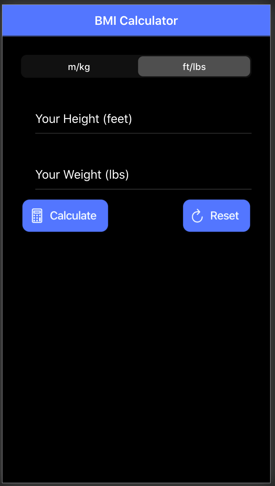
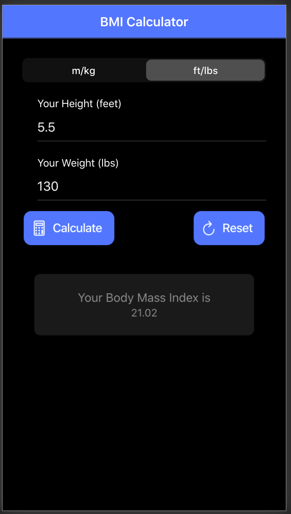
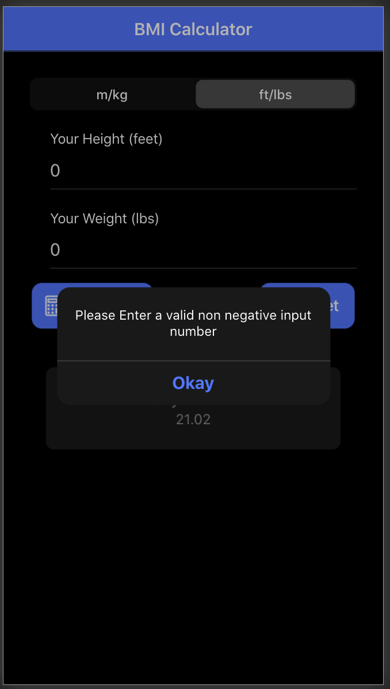

# BMI Calculator

<iframe
  src="/Preview.mov"
  style="width:100%; height:300px;"
></iframe>

### To run this app on your local machine: 
* Need to have node.js installed:
    * to install: https://nodejs.org/
    * to verify run 'node -v'
* Install NPM (node package manager) and ionic:
    * to install run 'npm install -g @ionic/cli'
    * to verify run 'npm -v'
* Clone Repository and run 'ionic start' 
    * this should open up the app on a local server window.

* Created following tutorial : https://www.youtube.com/watch?v=_03VKmdrxV8&t=2513s
